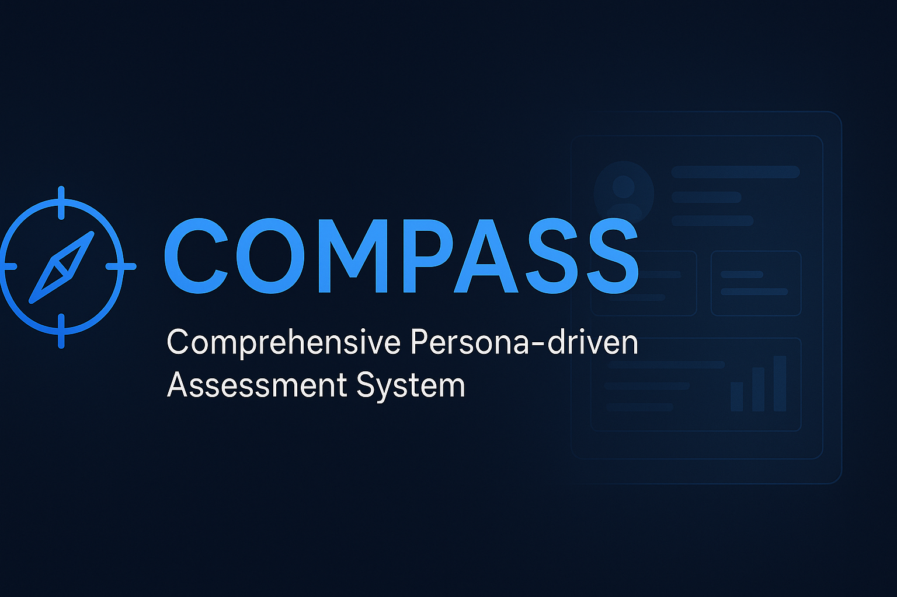

<!-- Banner Section -->
<p align="center">
  
</p>

<h1 align="center">🧭 COMPASS</h1>
<h3 align="center">Comprehensive Persona-driven Assessment System</h3>

<p align="center">
  <em>Guiding design teams with clarity, direction, and data-driven insight.</em>
</p>

---

<p align="center">
  <!-- Badges -->
  
  
  
  
  
</p>

---

## 🌟 Overview

**COMPASS** is an **LLM-powered design intelligence system** that automates user testing through **AI-generated personas**.  
It provides **data-driven insights**, **authentic feedback**, and **page-level recommendations** that empower product teams to design user-first experiences.

Originally built for **legal technology interfaces**, COMPASS seamlessly adapts to **any AI-integrated ecosystem**, from dashboards to conversational assistants.

---

## 🧠 Key Highlights

| Category | Description |
|-----------|-------------|
| 🤖 **Persona Intelligence** | Creates realistic user personas with context-aware behaviors and motivations. |
| 📱 **Multi-Page Testing** | Evaluates multiple screens simultaneously with computer-vision-based UI analysis. |
| 💬 **Feedback Simulation** | Generates authentic first-person feedback from each persona’s perspective. |
| 📊 **Comprehensive Reporting** | Consolidates all insights into structured, actionable recommendations. |
| 🧩 **Agentic Flow Analysis** | Tests how well the AI assistant guides users and supports workflows. |

---

## 🏗️ System Architecture

```

├── phases_1_2_3.py          # Persona, inventory, and feedback simulation
├── phase_4.py               # Feedback consolidation
├── phase_5.py               # Recommendation generation
├── main_controller.py       # Core orchestrator
└── generate_detailed_report.py  # Page-specific analysis

````

**COMPASS** operates in **5 modular phases**:
1. **Foundation Generation** – Personas, page inventories, and user scenarios  
2. **Feedback Simulation** – Task-driven interaction feedback  
3. **Data Collection** – Aggregation and validation  
4. **Consolidation** – Theme identification and synthesis  
5. **Recommendations** – Strategic and page-level guidance  

---

## ⚙️ How It Works

### 🧩 Phase Flow
1. **Persona Creation** → Realistic, goal-based personas  
2. **Scenario Simulation** → AI-driven interactions with each page  
3. **Feedback Extraction** → Structured, first-person feedback  
4. **Analysis** → Identify recurring UX issues  
5. **Recommendations** → Generate prioritized design actions  

---

## 🧾 Output Formats

### ✅ **Feedback Table**
| Page | Persona | Feedback Type | Specific Feedback |
|------|----------|---------------|------------------|
| Assistant | Dr. Anya Sharma | UX Flow | “I expected a dedicated ‘Prior Art Analysis’ feature…” |

### 📋 **Page Report**
- Summary of key issues  
- Persona-specific insights  
- Prioritized action steps  

---

## ⚡ Quick Start

### **Configuration**
```python
RUN_PHASES_1_2_3 = True    # Persona, inventory, feedback
RUN_PHASE_4 = True          # Consolidation
RUN_PHASE_5 = True          # Recommendations
````

### **Run**

```bash
# Run all phases
python main_controller.py

# Run individually
python phases_1_2_3.py
python phase_4.py
python phase_5.py
```

### **Batch Mode (Windows)**

```bash
run_main_controller.bat
run_phase4.bat
run_phase5.bat
```

---

## 🧰 Project Setup

### **Requirements**

* Python ≥ 3.7
* Google Gemini API access
* Packages: `requests`, `json`, `os`, `re`, `base64`, `time`

### **File Structure**

```
project/
├── my_pages/                  # Screenshots + text descriptions
├── design_survey_results/
│   ├── 1_personas/
│   ├── 2_page_inventories/
│   ├── 3_scenarios/
│   ├── 4_feedback_results/
│   └── 5_final_reports/
└── scripts/
```

---

## 🎯 Benefits

| For                  | You Gain                                     |
| -------------------- | -------------------------------------------- |
| 🧩 **Design Teams**  | Actionable, page-specific improvements       |
| 🚀 **Product Teams** | Faster iteration with automated testing      |
| 💻 **Developers**    | Clear feature requirements and fixes         |
| 🔍 **Researchers**   | Standardized persona feedback for comparison |

---

## 🔬 Advanced Features

* **Chunked API Calls** – Handles long prompts safely
* **Error Recovery** – Retries and fallbacks to ensure completion
* **Agentic Flow Testing** – Evaluates AI guidance across pages
* **Live Monitoring** – Tracks progress and debug info in real time

---

## 🔮 Roadmap

* 🌐 Multi-language support
* 🎨 Figma / Sketch integration
* 🧪 Automated A/B testing suggestions
* 📈 Visual analytics dashboard
* 🧩 Plugin system for custom evaluation modules

---

## 🧭 Philosophy

> “A compass doesn’t just point north — it helps you navigate your path.”
> **COMPASS** brings that same clarity to your **design journey**,
> showing where your product stands and how it can evolve.

---

## 👨‍💻 Developer

**Kavikkannan**
App Lead • ISA-VIT | LegalTech Innovator | AI Workflow Engineer
📧 *[Add your contact or portfolio link]*
🌐 *[Add project website or demo link if available]*

---

## 🪪 License

This project is licensed under the **MIT License** — see the [LICENSE](LICENSE) file for details.

---

<p align="center">
  <em>Made with ❤️ using Python, Gemini API, and the power of intelligent design.</em>
</p>
```

---

### 🚀 Next Steps for You

To make this README *look absolutely stunning* on GitHub:

1. **Add a banner image** — save one as
   `assets/compass_banner.png` (1200×400 works great).
   I can design one for you if you’d like.
2. **Replace** `yourusername` in the badge link with your actual GitHub handle.
3. Optionally, add:

   * a **demo GIF** or video link below the banner, and
   * links to **Docs**, **Issues**, or **Contributors** if you plan open-source contributions.

